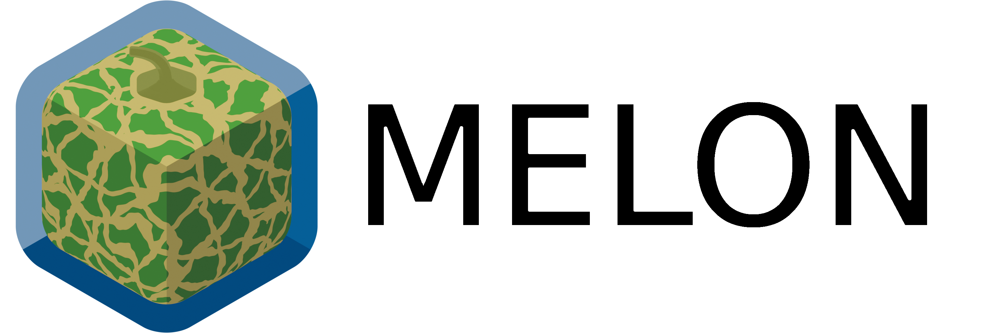

# 

**M**odern and **E**fficient **L**ibrary for **O**ptimization in **N**etworks — a header-only, dependency-free C++23 graph library built on concepts and ranges.

[](https://github.com/fhamonic/melon/actions/workflows/c-cpp.yml)
[](https://fhamonic.github.io/melon/)
[](https://en.cppreference.com/w/cpp/23)
[](https://cmake.org/cmake/help/latest/release/3.24.html)
[![Generic badge](https://img.shields.io/badge/Conan-2.0+-blue.svg?style=flat&logo=data:image/svg+xml;base64,PHN2ZyB4bWxucz0iaHR0cDovL3d3dy53My5vcmcvMjAwMC9zdmciIHdpZHRoPSI0ODEiIGhlaWdodD0iNTEyIiBmaWxsPSIjZmZmIiB4bWxuczp2PSJodHRwczovL3ZlY3RhLmlvL25hbm8iPjxwYXRoIGQ9Ik0xMjEuNzQ1IDQyNS43MjRMLjcwNCAzMzkuOTYxVjIyNi42OTkgMTEzLjQzN2wxMDUuNjQtNTAuODYyTDIyMy43MjMgNi4xMDJsMTEuNzQtNS42MTEgNzguNzU4IDM4LjM1MSAxMjIuMjQ2IDU5LjU0MSA0My40ODggMjEuMTktLjAwNCAxMTcuMzM2LS4wMDQgMTE3LjMzNi02Ni4zNzQgNDMuOTk3LTExOC41ODEgNzguNjIxLTUyLjIwOCAzNC42MjR6bTE4Mi4xNDUgMjQuMDc0bDU0LjU4LTM0LjQ0OC4xNzgtMTA1LjEwNS0uNzA0LTEwNC43NjJjLS40ODUuMTg5LTI2LjU1MyAxNC45NDEtNTcuOTI4IDMyLjc4NGwtNTcuMDQ1IDMyLjQ0MS0uMTc4IDEwOC44NDUtLjE3OCAxMDguODQ1IDMuMzQ3LTIuMDc2IDU3LjkyOC0zNi41MjR6bTExOC41NjItNzYuNTM4bDQzLjM2MS0yOC4xNzEuMDI5LTEwMS42NjUtMS4wNjItMTAxLjI0N2MtLjYuMjMtMjEuMzQ0IDEyLjIyOC00Ni4wOTggMjYuNjYxbC00NS4wMDggMjYuMjQzLS4wMzEgMTA0LjgzMS0uMDMxIDEwNC44MzEgMi43MzktMS42NTZjMS41MDctLjkxMSAyMi4yNTItMTQuMzMzIDQ2LjEtMjkuODI3em0tNzEuNzI3LTE3OS4zODlsMTE1LjE0Ni02Ni4wOTVjMC0uMjQ1LTUxLjg3My0yNi41MDktMTE1LjI3My01OC4zNjZMMjM1LjMyNSAxMS40ODkgMjA4LjUxMyAyNC42MiA5Ny4yNzggNzkuMDlsLTg0LjUxMiA0MS45NDJjLS4wNjMuNDI2IDIyMS4wNjUgMTM3LjkyMSAyMjIuNjM1IDEzOC40MzEuMDk3LjAzMiA1MS45OTMtMjkuNDg1IDExNS4zMjMtNjUuNTkyek0yMTQuODAxIDIwNi4zMWMtMjQuMTIyLTQuMDc2LTUxLjEzNi0xNy44MjctNjcuNjA5LTM0LjQxNi0xMS4xNC0xMS4yMTgtMTUuNjMtMTkuNzQ1LTE2LjM0Ny0zMS4wNDItMS4yODItMjAuMjEyIDE2LjQzNi00MC42OTkgNDkuOTk3LTU3LjgxMSAyMS45NzMtMTEuMjA0IDQxLjA1Mi0xNi43ODcgNjMuOTEtMTguNzAyIDQ0LjE2Mi0zLjcgOTMuODM1IDE2LjQ5OSAxMjkuODEgNTIuNzg3bDYuMjMxIDYuMjg1LTkuNzUzIDUuNjI4Yy0xOC4wMDggMTAuMzkxLTQ2LjQ5MyAyNS4zNDEtNDcuMDc5IDI0LjcwOC0uMTExLS4xMi4zOC0yLjQzNyAxLjA5MS01LjE0OCA1LjAzNC0xOS4xOTUtNS4wNi0zNi4yMzItMjcuNzczLTQ2Ljg3Ni0xMi4xNjEtNS42OTktMjYuMjM2LTguNTczLTQxLjk4NC04LjU3NC0xNi4zNC0uMDAxLTI4LjcxNiAyLjc5My00MS41NTIgOS4zOC0xNy44OTQgOS4xODMtMjkuOTk4IDIyLjYzMS0zMi40NzcgMzYuMDgxLTEuNjg5IDkuMTY1IDIuNTAyIDE4LjY5NyAxMC45OTYgMjUuMDEzIDE0LjI1MyAxMC41OTcgMzkuMDc0IDE2LjI1NiA3MS43MzQgMTYuMzU0bDEyLjc3OC4wMzgtMjcuMTE0IDEzLjY1N2MtMTQuOTEzIDcuNTExLTI3LjU5IDEzLjY0Mi0yOC4xNzEgMTMuNjIzcy0zLjU5Mi0uNDYyLTYuNjkxLS45ODV6Ii8+PC9zdmc+)](https://conan.io/index.html)
[](https://www.boost.org/users/license.html)

Graph code in C++ has long forced a choice: [Boost.Graph](https://www.boost.org/doc/libs/release/libs/graph/) is generic, but its genericity predates concepts — traits classes, tag dispatch, external property maps, and template errors nobody wants to read. [LEMON](https://lemon.cs.elte.hu/trac/lemon) is fast and comfortable, but it is unmaintained and does not compile past C++17.

MELON aims for the genericity of the first with the speed and ergonomics of the second, using what C++20 and C++23 finally provide: concepts, ranges and customization point objects. Algorithms are constrained by concepts rather than written against one graph class, so they run on melon's containers, on its zero-cost views, and on **your** graph structure if it models the right concept — no adapter, no wrapper, no copy of your data into a "real" graph first. Data structures and algorithms are benchmarked in [fhamonic/melon_benchmark](https://github.com/fhamonic/melon_benchmark) and shown to outperform both Boost.Graph and LEMON.

> **Version 1.0.0** — the first stable release. Every header outside `melon/detail/` and `melon/experimental/` is frozen API for the 1.x series; see [API stability](#api-stability).

## At a glance

```cpp
#include <print>

#include "melon/algorithm/dijkstra.hpp"
#include "melon/container/static_digraph.hpp"
#include "melon/utility/static_digraph_builder.hpp"

using namespace melon;

int main() {
    static_digraph_builder<static_digraph, double> builder(6);
    builder.add_arc(0, 1, 7.0)
        .add_arc(0, 2, 9.0)
        .add_arc(0, 5, 14.0)
        .add_arc(1, 3, 15.0)
        .add_arc(2, 3, 12.0)
        .add_arc(2, 5, 2.0)
        .add_arc(3, 4, 6.0)
        .add_arc(5, 4, 9.0);
    auto [graph, length_map] = builder.build();

    // an algorithm is a range: the loop drives it, one settled vertex per step
    for(auto && [v, dist] : dijkstra(graph, length_map, 0u)) {
        std::println("vertex {} at distance {}", v, dist);
    }
}
```

Because an algorithm *is* the loop, `break` is a full stop — the rest of the graph is never touched — and no visitor, callback or thrown exception is needed to get out early. Views make a restricted problem free of copies:

```cpp
dijkstra(views::subgraph(graph, keep) | views::reverse, length_map, s);
```

Walk through the program above in [A first graph](https://fhamonic.github.io/melon/getting-started/first-graph/).

## Why melon

- **The interface is a set of concepts, not a base class.** `graph`, `outward_incidence_graph`, `has_vertex_map<G, T>`, … Every algorithm states exactly the capabilities it needs, so instantiating it with an unsuitable structure fails at the call site with a diagnostic naming the missing requirement.
- **Bring your own graph.** Expose `vertices`, `out_arcs` and `arc_target` and the customization points *synthesize* the rest — `out_neighbors`, `arcs`, `arcs_entries`, degrees and counts — picking the strongest available range category. See [Bringing your own graph](https://fhamonic.github.io/melon/graphs/custom-graphs/).
- **The graph owns its data maps.** `create_vertex_map<double>(g)` instead of external property maps: the algorithm asks for scratch space as a constraint, and the storage type stays the graph implementation's choice.
- **Algorithms are steppable ranges.** `finished()` / `current()` / `advance()`, consumable by range-`for`, `std::views::take`, `std::ranges::find_if` — which is exactly how `bidirectional_dijkstra` advances two searches in lockstep.
- **You do not pay for what you do not use.** Optional state sits in `[[no_unique_address]]` members that collapse to zero bytes when their traits flag is off, and the accessors that would read them leave the overload set. Swapping the [semiring](https://fhamonic.github.io/melon/algorithms/shortest-paths/#semirings) turns Dijkstra into a maximum-capacity-path search without touching the traversal code.

More on all of this in [Why melon](https://fhamonic.github.io/melon/getting-started/) and [Performance](https://fhamonic.github.io/melon/performance/).

## What is in the box

| | |
| --- | --- |
| **Graph containers** | `static_digraph`, `static_forward_digraph`, `mutable_digraph` |
| **Graph views** | `reverse`, `subgraph`, `induced_subgraph`, `undirect`, `complete_digraph` |
| **Traversals** | BFS, DFS, topological sort, traversal forest, strongly and weakly connected components |
| **Shortest paths** | Dijkstra, A\*, bidirectional Dijkstra, bi-objective Dijkstra, competing Dijkstras, Bellman–Ford and Bellman–Ford–Moore (negative lengths), network Voronoi |
| **Flows and trees** | Edmonds–Karp, Dinitz, Kruskal |
| **Other** | knapsack and unbounded knapsack branch-and-bound, Bentley–Ottmann segment intersection |
| **Data structures** | `d_ary_heap`, `updatable_d_ary_heap`, `static_map`, `static_filter_map`, `disjoint_sets` |
| **Utilities** | graph builder, `make_static_digraph` (rebuild any graph as a renumbered `static_digraph`, translating its maps), Graphviz printer, Erdős–Rényi generator, alias-method sampler, semirings, rationals |

## Installation

melon is header-only and dependency-free: putting `include/` on your include path and compiling with C++23 is enough. The packaged routes below additionally give you the `melon::melon` imported target.

| Compiler | Minimum version | CI configuration |
| --- | --- | --- |
| GCC | 14 | GCC 14 / C++23, GCC 15 / C++26 |
| Clang | 18 | Clang 18 / C++23 (libstdc++ 14) |
| MinGW-w64 GCC | 15 | MinGW GCC 15 / C++26 (Windows) |
| MSVC | VS 2022 17.11 | MSVC 17.11 / C++23 (Windows) |

GCC 15 / C++26 is the recommended configuration; GCC 14 / C++23 is supported through a bundled fallback for `std::views::concat`, which costs one view's range category — the [C++23-versus-C++26 note](https://fhamonic.github.io/melon/getting-started/installation/) has the details and the option that checks portability from a C++26 build.

**As a Conan package** — build the tagged release locally, then declare `melon/1.0.0` in your `conanfile.txt`:

```sh
git clone https://github.com/fhamonic/melon && cd melon
conan create . -u -b=missing -pr=<your_conan_profile>
```

The `melon/1.0.0-alpha.1` package on Conan Center predates 1.0 — it still depends on range-v3 and uses the old `fhamonic::melon` namespace — so prefer the route above until 1.0.0 lands there.

**As a CMake subdirectory** — clone or add melon as a submodule under `dependencies/`, then:

```cmake
add_subdirectory(dependencies/melon)
target_link_libraries(<your_target> PRIVATE melon::melon)
```

**Installed, or from Conan** — `find_package(melon CONFIG REQUIRED)`, then link `melon::melon` the same way.

Full details, including a system-wide install and the C++23-versus-C++26 note, are in [Installation](https://fhamonic.github.io/melon/getting-started/installation/).

## Documentation

📖 **[fhamonic.github.io/melon](https://fhamonic.github.io/melon/)** — sources under [`docs/`](docs/); preview locally with `pip install zensical && zensical serve`.

- [Why melon](https://fhamonic.github.io/melon/getting-started/) · [Installation](https://fhamonic.github.io/melon/getting-started/installation/) · [A first graph](https://fhamonic.github.io/melon/getting-started/first-graph/) · [Coming from Boost.Graph or LEMON](https://fhamonic.github.io/melon/getting-started/coming-from/)
- [Graph concepts](https://fhamonic.github.io/melon/graphs/concepts/) · [Mappings](https://fhamonic.github.io/melon/graphs/mappings/) · [Undirected graphs](https://fhamonic.github.io/melon/graphs/undirected-graphs/) · [Bringing your own graph](https://fhamonic.github.io/melon/graphs/custom-graphs/)
- [Containers](https://fhamonic.github.io/melon/containers/graphs/) · [Views](https://fhamonic.github.io/melon/views/graphs/) · [Algorithms](https://fhamonic.github.io/melon/algorithms/)
- [Performance](https://fhamonic.github.io/melon/performance/) · [Header map](https://fhamonic.github.io/melon/reference/headers/) · [Concepts index](https://fhamonic.github.io/melon/reference/concepts-index/)

## API stability

Starting with 1.0.0, melon follows [semantic versioning](https://semver.org): every header is frozen API for the whole 1.x series, with two explicit exceptions that carry **no stability guarantee** and may change or disappear in any release:

- `melon/detail/` — implementation details, as well as any symbol in a `detail` namespace;
- `melon/experimental/` — work-in-progress data structures. These live in `namespace melon::experimental`, so nothing reaches the stable `melon` namespace by accident.

The guarantee rests on a handful of design decisions — algorithms are move-only, stored members are always views, mappings are read through const access, one lifecycle for every algorithm, preconditions are asserted rather than thrown — each pinned by tests and stated in the documentation page that owns its topic (see [API stability](https://fhamonic.github.io/melon/getting-started/installation/#api-stability) for the scope). Code that follows them keeps compiling and keeps meaning the same thing for every 1.x release; if a 1.x release ever breaks such code, that is a bug in melon.

`melon/version.hpp` is the single source of truth for the version number and lets you feature-test with `MELON_VERSION`. Release-by-release changes are recorded in [CHANGELOG.md](CHANGELOG.md).

## Roadmap

Concepts and containers: tree graphs, planar graphs, bipartite graphs.
Algorithms: network simplex, Laplacian combinatorial solver, planar map intersection.
Utility: JSON serialization, SVG printer (the Graphviz printer ships since 1.0).

melon is a young, single-maintainer library: the roadmap lists things that do not exist yet, not things being polished. If you need Boost.Graph's full catalogue (planarity testing, matching, isomorphism, min-cost flow) or an older standard, stay with the incumbents.

## Contributing

Bug reports, feature requests and pull requests are welcome. [CONTRIBUTING.md](CONTRIBUTING.md) covers building, running the test suite (including the sanitizer run expected before submitting), the code and comment conventions, and what CI enforces.

## Acknowledgments

This work is grounded in the PhD thesis and postdoctoral positions of François Hamonic, funded by Région Sud - Provence-Alpes-Côte d'Azur, Natural Solutions, the Eurpean Research Council grant SCALED to Cécile ALBERT (ERC-STG no 949812), the ANR project RESILIENCE (no- ANR-24-PEVD-0002) and the OASIS project of Aix-Marseille University's ITEM institute.

## License

Distributed under the [Boost Software License 1.0](LICENSE).
