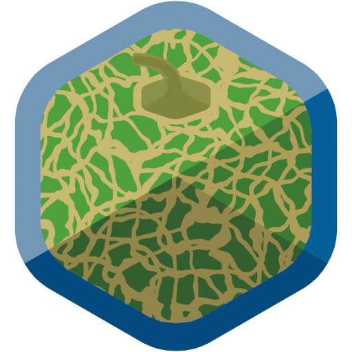

---
# The H1 below is the hero wordmark; without this the tab reads "MELON - MELON".
# An empty title makes the template fall through to the bare site_name.
title: ""
---

<div class="melon-hero" markdown>



# MELON

**Modern and Efficient Library for Optimization in Networks.**

[Get started](getting-started/index.md){ .md-button .md-button--primary }
[View on GitHub](https://github.com/fhamonic/melon){ .md-button }

---

</div>

MELON is a header-only C++23 graph library built on ranges and concepts. It aims to be as pleasant to use as the standard library and as fast as [LEMON](https://lemon.cs.elte.hu/trac/lemon) — which is unmaintained and no longer compiles past C++17 — without the type-erasure and property-map machinery of [Boost.Graph](https://www.boost.org/doc/libs/release/libs/graph/). Algorithms are constrained by concepts rather than written against one graph class, so they run on melon's containers, on its zero-cost views, and on **your** graph structure if it models the right concept.

```cpp
#include <print>

#include "melon/algorithm/dijkstra.hpp"
#include "melon/container/static_digraph.hpp"
#include "melon/utility/static_digraph_builder.hpp"

using namespace melon;

int main() {
    static_digraph_builder<static_digraph, double> builder(6);
    builder.add_arc(0, 1, 7.0)
        .add_arc(0, 2, 9.0)
        .add_arc(0, 5, 14.0)
        .add_arc(1, 3, 15.0)
        .add_arc(2, 3, 12.0)
        .add_arc(2, 5, 2.0)
        .add_arc(3, 4, 6.0)
        .add_arc(5, 4, 9.0);
    auto [graph, length_map] = builder.build();

    // an algorithm is a range: the loop drives it, one settled vertex per step
    for(auto && [v, dist] : dijkstra(graph, length_map, 0u)) {
        std::println("vertex {} at distance {}", v, dist);
    }
    return 0;
}
```

## Where to start

The documentation follows the way the library is layered: the concepts first, then what implements them, then what consumes them.

**1. Getting started** — read in order, about half an hour.

- [**Why melon**](getting-started/index.md) — the design decisions behind the library and who it is (and is not) for. **Start here.**
- [**Installation**](getting-started/installation.md) — compiler requirements, Conan, CMake, `find_package`.
- [**A first graph**](getting-started/first-graph.md) — a guided tour of the program above.
- [**Coming from Boost.Graph or LEMON**](getting-started/coming-from.md) — a translation table and the four things that differ.

**2. The graph model** — [graph concepts](graphs/concepts.md), [mappings](graphs/mappings.md), [undirected graphs](graphs/undirected-graphs.md), and [bringing your own graph](graphs/custom-graphs.md).

**3. Containers** — [graph containers](containers/graphs.md) (`static_digraph`, `mutable_digraph`, …) and the [maps, heaps and disjoint sets](containers/data-structures.md) the algorithms are built on.

**4. Views** — [graph views](views/graphs.md) (`reverse`, `subgraph`, `undirect`, …) and the [ownership and mapping views](views/ownership.md) that make lambdas usable as maps.

**5. Algorithms** — [why they are ranges](algorithms/index.md), then [traversals](algorithms/traversals.md), [shortest paths](algorithms/shortest-paths.md), [flows and spanning trees](algorithms/flows-and-trees.md), and [combinatorial and geometric](algorithms/others.md) ones.

## What is in the box

| | |
| --- | --- |
| **Graph containers** | `static_digraph`, `static_forward_digraph`, `mutable_digraph` |
| **Graph views** | `reverse`, `subgraph`, `induced_subgraph`, `undirect`, `complete_digraph` |
| **Traversals** | BFS, DFS, topological sort, traversal forest, strongly and weakly connected components |
| **Shortest paths** | Dijkstra, bidirectional Dijkstra, bi-objective Dijkstra, competing Dijkstras, network Voronoi |
| **Flows and trees** | Edmonds–Karp, Dinitz, Kruskal |
| **Other** | knapsack and unbounded knapsack branch-and-bound, Bentley–Ottmann segment intersection |
| **Data structures** | `d_ary_heap`, `updatable_d_ary_heap`, `static_map`, `static_filter_map`, `disjoint_sets` |
| **Utilities** | graph builder, Graphviz printer, Erdős–Rényi generator, alias-method sampler, semirings, rationals |

## Requirements

Header-only and dependency-free. **C++23** is the baseline; GCC 15 / C++26 is recommended.

| Compiler | Minimum version | CI configuration |
| --- | --- | --- |
| GCC | 14 | GCC 14 / C++23, GCC 15 / C++26 |
| Clang | 18 | Clang 18 / C++23 (libstdc++ 14) |
| MinGW-w64 GCC | 15 | MinGW GCC 15 / C++26 (Windows) |
| MSVC | — | not supported |

## Status

melon is under active development towards its first stable release; the API is not frozen until 1.0.0 ships. See the [changelog](https://github.com/fhamonic/melon/blob/main/CHANGELOG.md) for what has landed, and [API stability](getting-started/installation.md#api-stability) for what the 1.x guarantee will and will not cover.

## Documentation, license

- 📖 Documentation: [fhamonic.github.io/melon](https://fhamonic.github.io/melon/) — sources live under [`docs/`](https://github.com/fhamonic/melon/tree/main/docs).
- 📊 Benchmarks against Boost.Graph and LEMON: [fhamonic/melon_benchmark](https://github.com/fhamonic/melon_benchmark).
- ⚖️ Licensed under the [Boost Software License 1.0](https://github.com/fhamonic/melon/blob/main/LICENSE).
